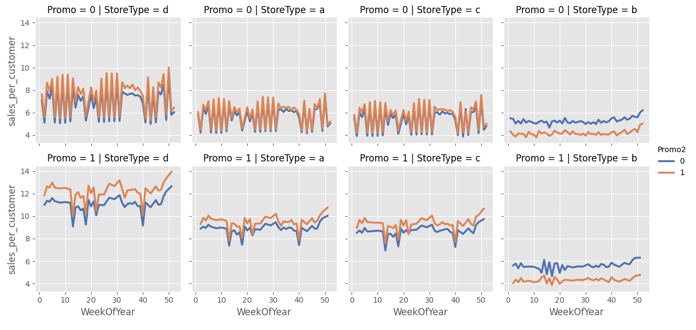
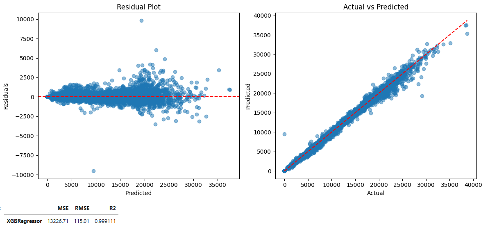
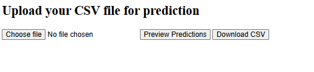

# Rossmann Store Sales Prediction

  

## Overview 
This project demonstrates **time series forecasting** skills. It predicts daily sales for Rossman stores using historical sales data, promotions, store metadata, and engineered features.

**Key highlights:**
- Clean **time-based validation**
- **Feature engineering** to capture seasonality and promotion effects
- Dockerized demo for **easy reproducibility**
- Interactive interface to **view predictions and download results**

## Dataset
- Kaggle: “Rossman Store Sales”
- Contains daily sales, promotions, store metadata, and time-based features
- [Dataset link](https://www.kaggle.com/competitions/rossmann-store-sales)

## Approach

### 1. Exploratory Data Analysis (EDA)
- Sales trends over time
- Weekly and seasonal patterns
- Effects of promotions and holidays
- Differences across store types

Detailed EDA notebooks are located in the `notebooks/` directory.



### 2. Feature Engineering
- Calendar features (day, week, month)
- Lagged sales values
- Rolling statistics
- Promotion indicators
- Store metadata

> **Note:** Special care taken to avoid data leakage in time-dependent features.

### 3. Modeling
- Models trained with **group time-based train/validation split**
- Ensures evaluation on future data only
- Modeling logic in `src/train/` directory

### 4. Evaluation Strategy
- Time series validation
- Baseline comparison
- Evaluation on unseen future periods
- Metric: **RMSE**

## Evaluation
**Evaluation plots:**  


**Metrics:**  
- RMSE: 115.01

## Results
- Models outperform naive baselines
- Captures seasonal and promotional effects
- Stable performance on validation data
- Detailed evaluation in notebooks

## Demo

### Running with Docker

```bash
# Build the image
docker build -t rossman-app .

# Run the container
docker run -p 8000:8000 rossman-app
```

Open [http://localhost:8000](http://localhost:8000) to see predictions or download results.

A small test input file is provided in `data/raw/sample_input.csv`.

## Screenshots


## What I Learned
- Time-based validation is critical in forecasting
- Target transformations improve regression on skewed data
- Feature leakage can silently inflate results
- Metric choice is as important as model choice

## Possible Improvements
- Hyperparameter optimization
- Additional lag and rolling window features
- Model ensembling
